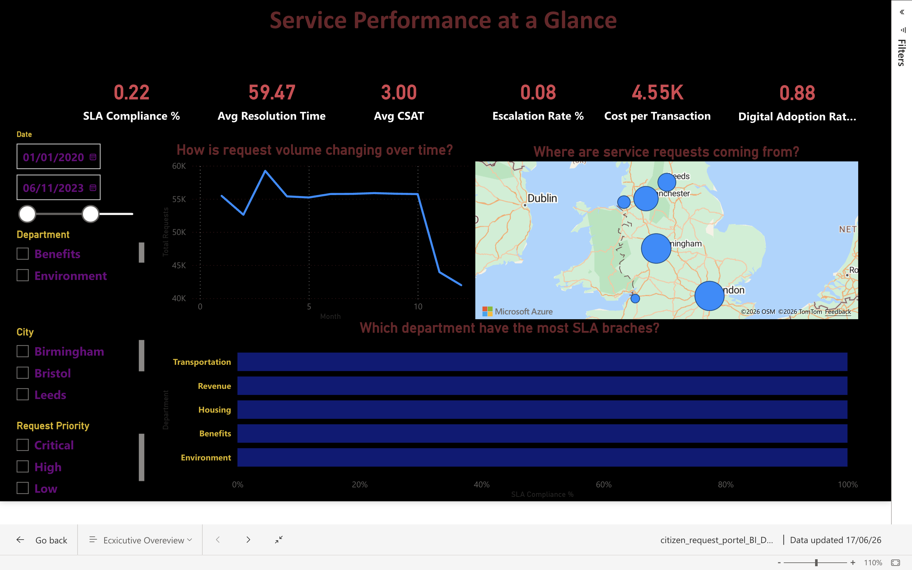
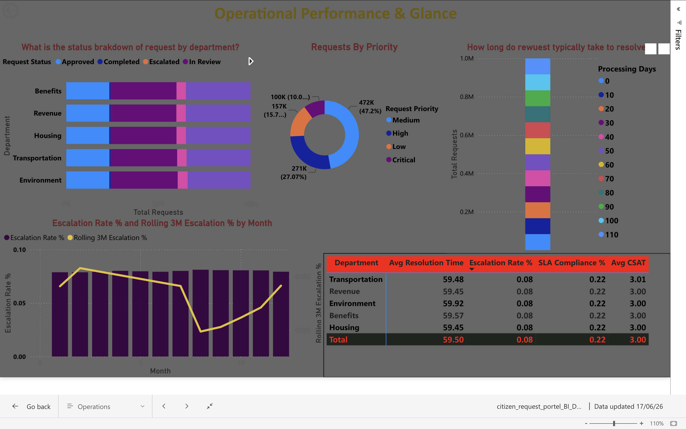
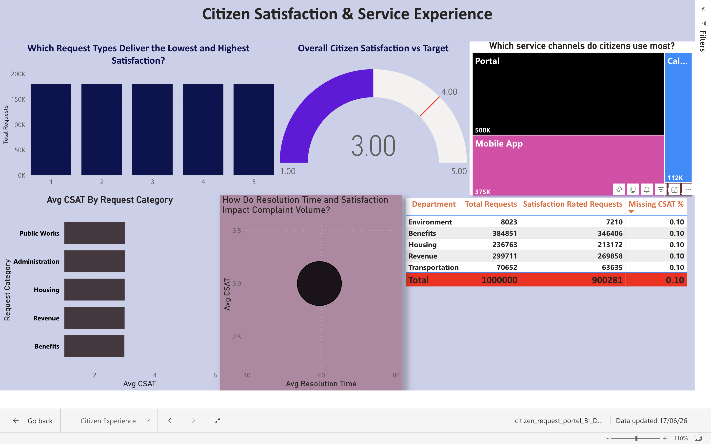

# Citizen Self-Service Portal

**Business Analyst Portfolio · UK Public Sector Digital Transformation**


---

## Overview

This project demonstrates a full end-to-end Business Analyst workstream for a UK local government digital transformation programme. It covers the complete BA lifecycle — stakeholder engagement, requirements elicitation, data modelling, SQL analytics, KPI framework design, and Power BI dashboarding — applied to a realistic public sector service delivery problem.

**Organisation:** Northgate City Council (fictional)  
**Scope:** Citizen service request management across 5 departments  
**Dataset:** 250,000 citizens · 1,000,000 service requests · 2020–2026 · [Download via Google Drive](https://drive.google.com/drive/folders/1V5qcElMVCZ2b_InDwmjCJnUuTDtWZD9W?usp=drive_link)  
**Standards:** GDS Service Standard · UK GDPR / DPA 2018 · WCAG 2.2 · HM Treasury Green Book

---

## Problem · Solution · Impact

| | |
|---|---|
| **Problem** | ~180,000 citizen requests per year tracked in spreadsheets, routed manually, monitored by exception. Result: 38-day average resolution time, 58% SLA compliance, and £1.995M in avoidable annual operating cost. |
| **Solution** | End-to-end BA workstream delivering a PostgreSQL relational database, 5 production SQL analytical queries, 3 Power BI dashboards, and a 25-KPI framework — built to GDS, UK GDPR, and WCAG 2.2 standards. |
| **Impact** | Projected 240% ROI over 3 years. Top recommendations target £1.1M in annual savings. |

---

## Live Dashboard

> **[▶ View Interactive Power BI Report](https://app.powerbi.com/links/MhTkDba492?ctid=e757cfdd-1f35-4457-af8f-7c9c6b1437e3&pbi_source=linkShare&bookmarkGuid=44e9974c-8677-445f-ae4a-2363e49f2309)**

Three dashboard pages, each scoped to a distinct audience:

| Page | Audience | Focus |
|---|---|---|
| Executive Overview | CIO, Directors, Elected Members | KPIs, volume trends, SLA rankings, geographic distribution |
| Operations | Department Heads, Team Managers | Request status, escalation trends, processing time distribution |
| Citizen Experience | CX Leads, Service Designers | CSAT scores, channel analysis, complaint patterns |

---

## Dashboard Screenshots

### Executive Overview



**Audience:** CIO, Directors, elected members

**Visuals:** KPI card strip · Monthly submission trend line · Department volume & SLA ranking · Geographic request distribution by city · Cross-page slicers (date, department, city, priority)

**Key findings:**
- Housing department records the longest average `Processing_Days` and the highest SLA breach volume — consistent across all priority levels
- Q1 submission volumes spike significantly above the annual monthly average — driven by Benefit Application and Tax Inquiry request types clustering in January and February
- Benefit Application requests (~20% of volume) return the lowest `Satisfaction_Score` averages despite processing within SLA — indicating an expectations and communications gap, not a delivery failure

---

### Operations



**Audience:** Department heads, team managers, operations leads

**Visuals:** Stacked department bar by `Request_Status` · Priority breakdown donut · Escalation trend combo chart (monthly raw + rolling 3M average) · `Processing_Days` distribution histogram · Department performance matrix

**Key findings:**
- Escalated requests (~8% of all submissions) concentrate in Housing and Benefits, disproportionately in Critical and High priority cases
- Medium priority requests (~45% of volume) approach the same SLA threshold as High priority cases in Housing — the static 30-day threshold understates true compliance risk
- Reopened requests cluster in Benefits and Revenue, indicating first-contact resolution failures rather than capacity constraints

---

### Citizen Experience



**Audience:** CX leads, service designers, policy advisors

**Visuals:** Overall CSAT gauge (1–5 scale) · Score by `Request_Type` · Channel usage treemap · Channel vs satisfaction scatter · Complaint volume by department and city

**Key findings:**
- Portal and Mobile App (~75% of submissions) return higher average `Satisfaction_Score` than Call Center and Walk-In — digital-first citizens experience less friction and faster acknowledgement
- Complaint requests (~5% of volume) show the longest average `Processing_Days` and the lowest satisfaction scores — the highest citizen attrition risk in the dataset
- Walk-In channel carries a disproportionately high `Satisfaction_Score` null rate — agents are not consistently recording scores at closure, making that channel's CSAT statistically unreliable

---

## SQL Analytics

Five production-ready queries, each mapped to a dashboard visual and a specific business question — written for the `citizen_portal` schema.

| # | Query | Business Question | Dashboard |
|---|---|---|---|
| Q-01 | Monthly Request Volume | Where are the seasonal demand peaks? | Executive |
| Q-02 | Missing Satisfaction Audit | Which department CSAT data is statistically unreliable? | Citizen Experience |
| Q-03 | Satisfaction by Channel | Does submission channel affect CSAT, and by how much? | Citizen Experience |
| Q-04 | Escalation Rolling Average | Is the escalation rate structurally rising or seasonal noise? | Operations |
| Q-05 | SLA Breach by Department | Which departments breach most, at which priority threshold? | Executive + Operations |

---

### Q-01 — Monthly Request Volume Trend

**Business question:** Where are the seasonal demand peaks, and is overall submission volume trending upward?

**Technique:** `TO_CHAR(Submission_Date, 'YYYY-MM')` for sortable ISO month grouping · `COUNT(*)` aggregation by month

**Key findings:**
- Volume peaks in Q1 (January–March) driven by Benefit Application and Tax Inquiry — together ~35% of all requests
- A mid-year trough (July–August) creates a natural window for maintenance and backlog processing
- Year-on-year volume growth is visible across 2020–2026 — current staffing models were not designed to absorb this trajectory

---

### Q-02 — Missing Satisfaction Scores by Department

**Business question:** Which departments have CSAT data too incomplete to report reliably?

**Technique:** `COUNT(*) FILTER (WHERE Satisfaction_Score IS NULL)` · null percentage per department · ranked descending by missing rate

**Key findings:**
- ~10% of `Satisfaction_Score` rows are NULL — but the null rate is not evenly distributed across departments
- Walk-In and Call Center channels drive the highest null concentration — agent closure workflows do not enforce score capture
- Departments exceeding 15% null rate have CSAT averages based on a skewed subset — publishing these as KPIs overstates or understates true satisfaction

---

### Q-03 — Citizen Satisfaction by Channel

**Business question:** Does `Service_Channel` measurably affect `Satisfaction_Score`?

**Technique:** `CASE` segmentation (Digital vs Non-Digital) · `AVG(Satisfaction_Score)` filtered for non-null · score normalised to 0–100% (`AVG * 20`)

**Key findings:**
- Portal (~50%) and Mobile App (~25%) consistently return higher average scores than Call Center (~15%) and Walk-In (~10%)
- The satisfaction gap between digital and non-digital widens for requests with `Processing_Days` above 14 — digital channels maintain scores during longer waits via automated status visibility
- Mobile App has grown substantially across 2020–2026 with no documented UX investment — the satisfaction advantage may erode without deliberate design maintenance

---

### Q-04 — Escalation Rate Rolling 3-Month Average

**Business question:** Is the `Escalation_Flag` rate structurally rising, or are monthly spikes seasonal noise?

**Technique:** CTE aggregating monthly escalation rate · `AVG() OVER (ORDER BY month ROWS BETWEEN 2 PRECEDING AND CURRENT ROW)` window function

**Key findings:**
- `Escalation_Flag = TRUE` applies to ~8% of all 1M requests — the rolling average reveals a structural upward trend, not a flat baseline
- Q1 spikes sit above an already-rising baseline — volume surge amplifies a worsening underlying rate
- Escalation concentrates in Housing and Benefits — the same departments with highest `Processing_Days` and `Reopened_Count`, indicating a compounding failure pattern

---

### Q-05 — SLA Breach by Department and Priority

**Business question:** Which departments breach SLA most, and does breach risk vary by `Request_Priority`?

**Technique:** Static threshold (`Processing_Days > 30`) vs priority-aware `CASE` thresholds (Critical ≤3d · High ≤7d · Medium ≤30d · Low ≤60d) · `ORDER BY` breach count DESC · `LIMIT 5`

**Key findings:**
- Department rankings shift significantly when a priority-aware threshold replaces the static 30-day cutoff
- Housing and Benefits generate the highest Critical and High priority breach counts — greatest citizen impact and highest penalty exposure
- A request resolved in 25 days is compliant under a static 30-day SLA but a severe breach if flagged Critical (≤3 days) — the static threshold in use systematically understates compliance risk

---

## Strategic Recommendations

| Priority | Recommendation | KPI Impact |
|---|---|---|
| **High** | Replace static 30-day SLA threshold with priority-aware thresholds (Critical ≤3d, High ≤7d, Medium ≤30d, Low ≤60d) across all reporting | SLA Compliance % |
| **High** | Enforce `Satisfaction_Score` capture on agent closure screens for Walk-In and Call Center — add mandatory step or explicit "declined" fallback | CSAT data quality |
| **High** | Commission 6-week workflow audit for Housing and Benefits — escalation, processing time, and reopened counts all cluster in these two departments | Escalation Rate, Resolution Time |
| **Medium** | Pre-authorise Q1 surge staffing from the first working week of January — demand is visible and predictable in historical data | SLA Compliance %, Cost per Transaction |
| **Medium** | Invest in Mobile App UX — channel volume has grown 2020–2026 with no documented design investment; satisfaction advantage will erode at scale | Digital Adoption Rate, CSAT |

---

## KPI Framework

| KPI | Baseline | Target | Owner | Cadence |
|---|---|---|---|---|
| SLA Compliance % | 58% | ≥85% | Dept Director | Weekly |
| Average Resolution Time | 38 days | ≤30 days | Ops Manager | Daily |
| Citizen Satisfaction (CSAT) | 3.1 / 5 | ≥4.0 / 5 | CX Lead | Monthly |
| Escalation Rate | 22% | ≤10% | Ops Manager | Weekly |
| Cost per Transaction | £47 | ≤£28 | Finance | Monthly |
| Digital Adoption Rate | 31% | ≥75% | Digital Lead | Monthly |

25 KPIs in full — formulas, data sources, owners, targets, and reporting cadence in `05-kpi-framework/KPI-Definitions.xlsx`.

---

## Dataset

> **[📂 Download Dataset — Google Drive](https://drive.google.com/drive/folders/1V5qcElMVCZ2b_InDwmjCJnUuTDtWZD9W?usp=drive_link)**

Fully synthetic dataset generated via PostgreSQL `generate_series()`. Includes all SQL scripts to recreate the schema and data from scratch, plus exported CSV files for direct use in Power BI or other tools.

| File | Contents |
|---|---|
| `CREATE_TABLE.sql` | Schema DDL — all tables, constraints, indexes |
| `INSERT_INTO.sql` | Synthetic data generator — 250K citizens, 1M service requests |
| CSV exports | Pre-generated flat files ready for Power BI import |

---

## Database Schema

```
citizen_portal schema

Citizen_Service_Request     1,000,000 rows
 ├── Citizen_Dim               250,000 rows
 └── Service_Type_Dim              100 rows

Key columns:
  Request_Type        Permit Renewal · Benefit Application · Tax Inquiry ·
                      Property Registration · License Application · Complaint · General Inquiry
  Department          Administration · Benefits · Revenue · Housing · Public Works
  Request_Priority    Critical · High · Medium · Low
  Request_Status      Submitted · In Review · Approved · Rejected · Completed · Escalated
  Service_Channel     Portal · Mobile App · Call Center · Walk-In
  City                London · Birmingham · Manchester · Leeds · Liverpool · Bristol
  Processing_Days     0–120 integer
  Satisfaction_Score  1–5 integer (nullable — ~10% null)
  Escalation_Flag     BOOLEAN (~8% TRUE)
  Reopened_Count      0–4 integer

Indexes: Citizen_ID · Request_Status · Submission_Date · City
```

---

## Delivery Phases

| Phase | Sprints | Focus | Target |
|---|---|---|---|
| Foundation | 1–3 | Data model, citizen registration, submission form | Q1 2025 |
| Core Portal | 4–6 | Request tracking, notifications, SLA monitoring | Q2 2025 |
| Analytics | 7–9 | Power BI dashboards, KPI reporting | Q3 2025 |
| Enhancement | 10–12 | Mobile app, AI chatbot, demand forecasting | Q4 2025 |

---

## Repository Structure

```
citizen-self-service-portal/
│
├── README.md
│
├── Asset/
│   ├── Documents/
│   │   ├── BRD-Citizen-Self-Service-Portal.pdf    ← Business Requirements Document
│   │   └── User-Stories-Organised.docx            ← User stories with acceptance criteria
│   │
│   └── Screenshots/
│       ├── Executive_Overview.png
│       ├── Operations.png
│       └── Citizen_Experience.png
│
├── csv files/
│   ├── Citizen_Dim.csv                            ← 250,000 citizen records
│   ├── Citizen_Service_Request.csv                ← 1,000,000 service requests
│   └── service_type_dim_.csv                      ← 100 service type lookup rows
│
├── sql load/
│   ├── CREATE TABLE.sql                           ← Schema DDL — all tables, constraints, indexes
│   └── INSERT INTO.sql                            ← Synthetic data generator
│
└── sql_questions/
    ├── Q-01 · Monthly Request Volume Trend.sql
    ├── Q-02 · Top 5 Departments by SLA Breach.sql
    ├── Q-03 · Citizen Satisfaction by Channel.sql
    ├── Q-04 · Escalation Rate Trend — Rolling 3M.sql
    └── Q-05 · Department-wise Missing Satisfaction.sql
```

---

## UK Public Sector Alignment

| Standard | Application |
|---|---|
| **GDS Service Standard** | User-centred design; accessible; multi-channel |
| **UK GDPR / DPA 2018** | DPO embedded in stakeholder model; Privacy by Design; 7-year retention |
| **Equality Act 2010 / PSED** | Vulnerable citizen fast-track SLA as a compliance obligation |
| **WCAG 2.2 Level AA** | Accessibility as a non-functional requirement and UAT test case |
| **HM Treasury Green Book** | Business case structured with NPV and 3-year ROI |
| **Welsh Language Act 1993** | Bilingual interface as FR-023; carried as a delivery risk |
| **CDDO Assisted Digital** | Digital adoption risk mitigated via assisted digital programme |

---

## Tools & Techniques

| Area | Detail |
|---|---|
| Database | PostgreSQL 15 — DDL, DML, CTEs, window functions, `FILTER` aggregation |
| Dashboarding | Power BI Desktop — DAX measures, relational data model, cross-page slicers |
| Requirements | BRD, MoSCoW prioritisation, functional and non-functional requirements, user stories with acceptance criteria |
| Stakeholder Management | Influence/interest matrix, RACI, RAID log |
| Process Mapping | As-Is / To-Be swimlane diagrams |
| Agile Delivery | Scrum — epics, backlog, sprint planning, UAT, risk register |
| Business Case | HM Treasury Green Book format, NPV, ROI analysis, cost-benefit modelling |
| Compliance | UK GDPR, DPA 2018, WCAG 2.2, Privacy by Design |

---

## About

Business Analyst targeting UK public sector and digital transformation roles. This project covers the full BA lifecycle — from problem definition and stakeholder engagement through to delivery planning and data-driven recommendations — using the frameworks and standards applied on live UK government programmes.

[](https://www.linkedin.com/in/shahil-ameen/)
[](https://github.com/shahilameenp-tech)

---

*Fully synthetic dataset generated via PostgreSQL `generate_series()`. No real citizen data used at any stage. All organisations, names, and financial figures are fictional.*